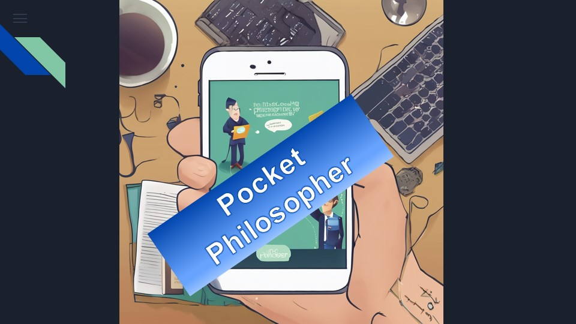

# Pocket Philosopher

## Overview

Pocket Philosopher is a unique application that allows users to chat with virtual philosophers about their ailments and life questions. The app leverages AI models to provide advice rooted in Stoic, Existentialist, and Eastern philosophies.

<iframe width="1905" height="799" src="https://www.youtube.com/embed/G57W2IP7FFc" title="Pocket Philosopher" frameborder="0" allow="accelerometer; autoplay; clipboard-write; encrypted-media; gyroscope; picture-in-picture; web-share" referrerpolicy="strict-origin-when-cross-origin" allowfullscreen></iframe>

## Features

- Chat with virtual philosophers: Stoic Tutor, Existentialist, and Eastern Guru.
- Receive advice based on ancient wisdom.
- Analyze and rate your happiness after each conversation.
- *Import and export chats (coming soon).*
- *Voice input support (coming soon).*

## Tech Stack

- **Frontend**: NextJS, TailwindCSS, shadcn-ui, Framer Motion, Lucide Icons
- **Backend**: Python, Flask, LangChain, Cohere API

## Installation

- Clone the repository: `git clone https://github.com/yelloSA96/ai-build-hackathon.git`
- Navigate to the project directory: `cd ai-build-hackathon`
- For instructions on installing the web app refer to: [frontend README](frontend/README.md)
- For installation instructions on the backend refer to: [backend README](backend/README.md)

## Authors
 - Chitradevi Ramachandran
 - Thomas Suebwichi
 - Shannon Gray
 - Joh Leonhardt

## License

[MIT](LICENSE)

